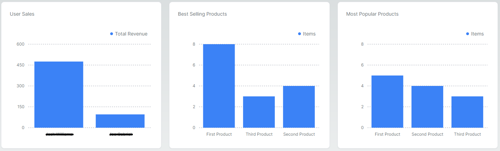
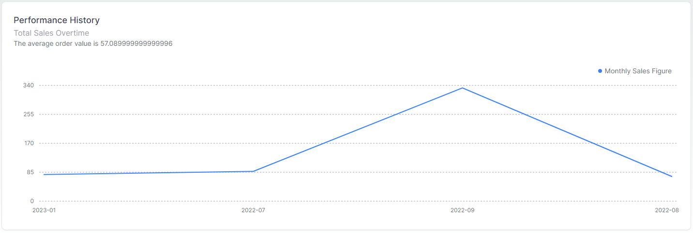

## Next.js_MongoDB_E-Commerce_Dashboard
This is a [Next.js](https://nextjs.org/) project bootstrapped with [`create-next-app`](https://github.com/vercel/next.js/tree/canary/packages/create-next-app) that displays KPI metrics for a fictional e-commerce back office management system. There are 3 main endpoints: users, products and orders and KPI metrics displayed showcase the number of documents in each collection, the most popular items and best selling products. The bottom section of the page shows the total sales accumulated and the average order value.

The dashboard UI components are built with [Tremor](https://www.tremor.so/) and the back-end data-source is a Cloud based MongoDB host called [Atlas](https://www.mongodb.com/atlas/database). The KPI metrics are driven by sophisticated queries utilising the MongoDB aggregation pipeline framework.

## Prerequisites
1) Node.js >= version 18.12.1
2) NPM >= version 9.6.4
3) MongoDB Atlas 

## Getting Started

Create a file called .env.local in the root directory and include;
MONGODB_URI=mongodb+srv://<User>:<Password>@<Cluster-Info>/<db_name>?retryWrites=true&w=majority
Run npm install from the root directiory
First, run the development server:

```bash
npm run dev
# or
yarn dev
# or
pnpm dev
```

Open [http://localhost:3000](http://localhost:3000) with your browser to see the result.

You can start editing the page by modifying `app/page.tsx`. The page auto-updates as you edit the file.

This project uses [`next/font`](https://nextjs.org/docs/basic-features/font-optimization) to automatically optimize and load Inter, a custom Google Font.

## Application Pictures



## Learn More

To learn more about Next.js, take a look at the following resources:

- [Next.js Documentation](https://nextjs.org/docs) - learn about Next.js features and API.
- [Learn Next.js](https://nextjs.org/learn) - an interactive Next.js tutorial.

You can check out [the Next.js GitHub repository](https://github.com/vercel/next.js/) - your feedback and contributions are welcome!

## Deploy on Vercel

The easiest way to deploy your Next.js app is to use the [Vercel Platform](https://vercel.com/new?utm_medium=default-template&filter=next.js&utm_source=create-next-app&utm_campaign=create-next-app-readme) from the creators of Next.js.

Check out our [Next.js deployment documentation](https://nextjs.org/docs/deployment) for more details.
